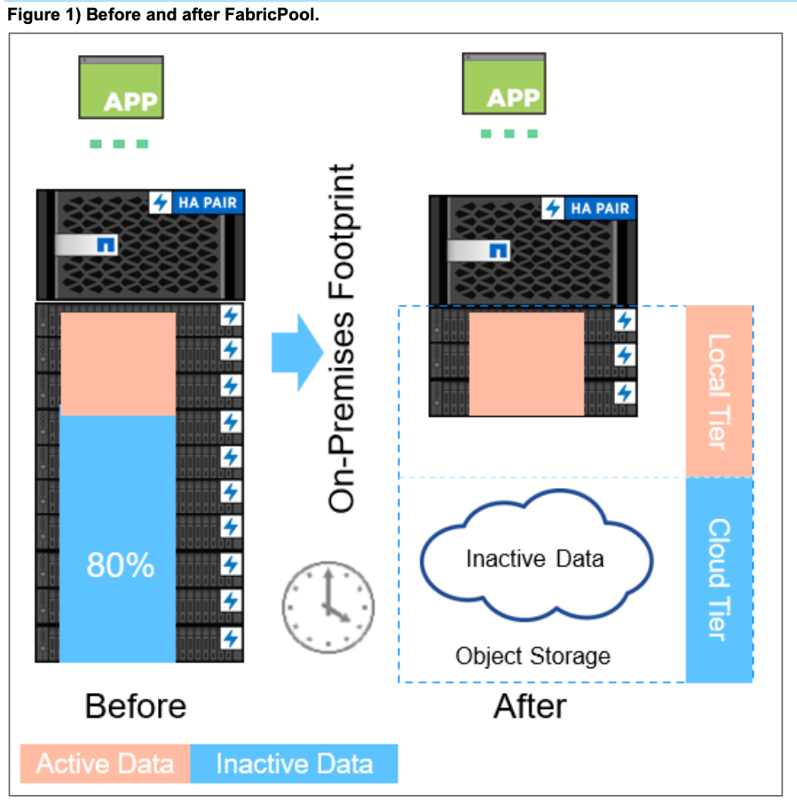
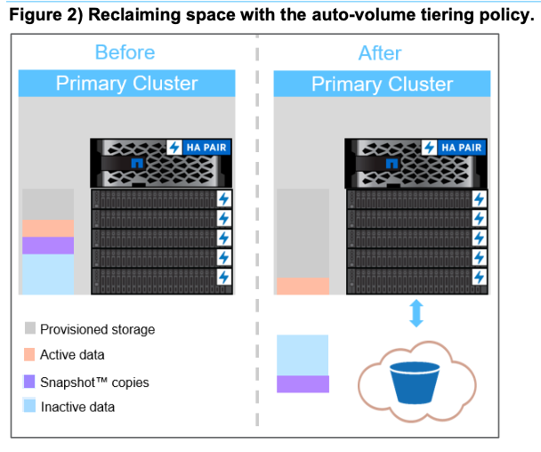
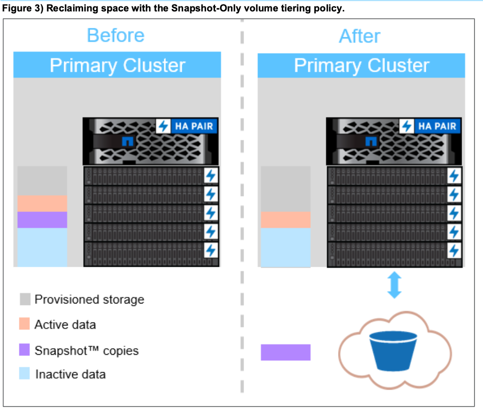
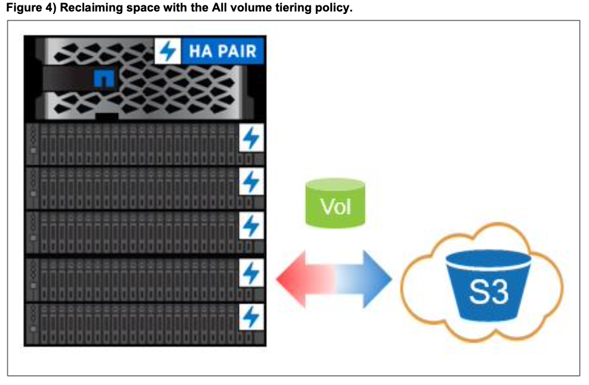
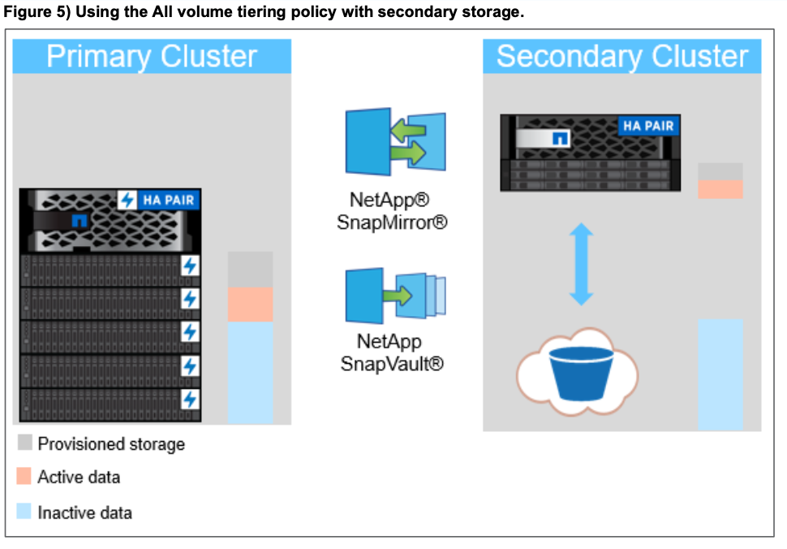

# What is FabricPool & Who Should Use It

## Overview

FabricPool, first available in ONTAP 9.2, is a data fabric powered by NetApp technology that automatically tiers data to low-cost object storage tiers either on or off premises.

Unlike manual tiering solutions, FabricPool reduces the total cost of ownership by automating the tiering of data, which lowers the cost of storage. It delivers the benefits of cloud economics by tiering to public clouds such as:

* Alibaba Cloud Object Storage Service
* Amazon S3
* Google Cloud Storage
* IBM Cloud Object Storage
* Microsoft Azure Blob Storage

 And to private clouds, such as NetApp StorageGRID®.

FabricPool is transparent to applications and allows you to benefit from cloud economics without sacrificing performance or having to rearchitect solutions to leverage storage efficiency:

• ONTAP supports FabricPool on SSD and HDD local tiers (also known as storage aggregates in the ONTAP CLI). Flash Pool aggregates are not supported.

• NetApp ONTAP Select supports FabricPool. NetApp recommends you to use all-SSD FabricPool local tiers.

• NetApp Cloud Volumes ONTAP supports data tiering with the following:

* Amazon S3
* Google Cloud Storage
* Microsoft Azure Blob Storage.

Figure 1 (below) shows your storage footprint before and after using FabricPool.

Figure 1 <small>

## Primary use cases

The primary purpose of FabricPool is reducing storage footprints and associated costs. With FabricPool, you assign Active data to high-performance local tiers, while tiering inactive data to low-cost object storage which preserves ONTAP functionality and data efficiencies.

FabricPool has two primary use cases:

• Reclaim capacity on primary storage

• Shrink the secondary storage footprint

Although FabricPool significantly reduces storage footprints in primary and secondary data centers, it is not a backup solution. The local tier continues to house access control lists (ACLs), directory structures, and NetApp WAFL® metadata. If a catastrophic disaster destroys the local tier, a new environment cannot be created using the data on the cloud tier because it contains no WAFL metadata.

To optimize your data protection, consider using existing ONTAP technologies such as NetApp SnapMirror® and NetApp SnapVault®.

### Reclaim capacity on primary storage (Auto, Snapshot-Only, or All)

To reclaim capacity on primary storage, your options are Auto (moves all cold blocks), Snapshot-Only (captured at specific points in time) or All (entire volumes of secondary data).

#### Auto

The majority of inactive (cold) data in storage environments is associated with unstructured data, accounting for more than 50% of total storage capacity in many storage environments.

Infrequently accessed data from irrelevant sources such as productivity software, completed projects, and old datasets is an inefficient use of high-performance storage capacity. Tiering this data to a low-cost object store is an easy way to reclaim existing local capacity and reduce the amount of required local capacity moving forward.

First available in ONTAP 9.4, the auto volume tiering policy shown in Figure 2 moves all cold blocks in the volume, not just blocks associated with NetApp Snapshot™ copies, to the cloud tier.

If read by random reads, cold data blocks on the cloud tier become hot and are moved to the local tier. If read by sequential reads such as those associated with index and antivirus scans, cold data blocks on the cloud tier stay cold and are not written to the local tier.

Figure 2

#### Snapshot-Only

Snapshot copies can frequently consume more than 10% of a typical storage environment. Although essential for data protection and disaster recovery, these point-in-time copies are rarely used and are another inefficient use of high-performance storage.

Snapshot-Only, a volume tiering policy for FabricPool, is an easy way to reclaim storage space on high-performance storage. While using this policy, cold Snapshot copy blocks in the volume that are not shared with the active file system are moved to the cloud tier. If read, cold data blocks on the cloud tier become hot and are moved to the local tier.

**Note: **The FabricPool Snapshot-Only volume tiering policy, as shown in Figure 3, reduces the amount of storage used by Snapshot copies on the local tier. It does not increase the maximum number of Snapshot copies allowed by ONTAP, which remains 1,023.

Figure 3 

#### All

In addition to cold primary data in active volumes (Auto) and snapshots (Snapshot-Only), another use of FabricPool is to move entire volumes of secondary (backup and recovery) data to low-cost clouds. Any dataset that must be retained but is unlikely to be read—Completed projects, legacy reports, or historical records —are ideal candidates for tiering to low-cost object storage.

Moving entire volumes is accomplished by setting the All volume tiering policy on a volume. The All volume tiering policy, as shown in Figure 4, is primarily used with secondary data and data protection Volumes.

**Note: **NetApp recommends you don’t use the All volume tiering policy with primary data (read/write volumes). SAN LUNs, which help identify data subsets to help execute operations, should not be hosted from volumes using the All volume tiering policy.

Data in volumes using the All tiering policy, (excluding data illegible for tiering) are immediately marked as cold and tiered to the cloud as soon as possible. There is no minimum wait for data to become cold and tiered. If read, cold data blocks on the cloud tier stay cold and are not written back to the local tier.

Figure 4

Shrink the secondary storage footprint (All)

Secondary data includes data protection volumes that are NetApp SnapMirror (disaster recovery) or NetApp SnapVault (backup) destination targets. This data is frequently stored on secondary clusters that share a 1:1 or greater ratio with the primary data that they are protecting (one baseline copy and multiple Snapshot copies). For large datasets, this approach can be prohibitively expensive, forcing you to make costly decisions about the data they need to protect.

Like Snapshot copies, data protection volumes are infrequently used and are another inefficient use of high-performance storage. The FabricPool All volume tiering policy changes this paradigm.

Instead of 1:1 primary-to-backup ratios, the FabricPool All policy allows you to significantly reduce the number of disk shelves on their secondary clusters, tiering most of the backup data to low-cost object stores. ACLs, directory structures, and WAFL metadata remain on the secondary cluster’s local tier.

If read, cold data blocks in volumes using the All policy are not written back to the local tier. This reduces the need for high-capacity secondary storage local tiers.

Figure 5

Figure 5 illustrates the secondary cluster as a traditional cluster running ONTAP. The secondary cluster can also be in the cloud using Cloud ONTAP Volumes, or in a software defined environment using ONTAP Select. You can tier data using FabricPool anywhere ONTAP can be deployed.
