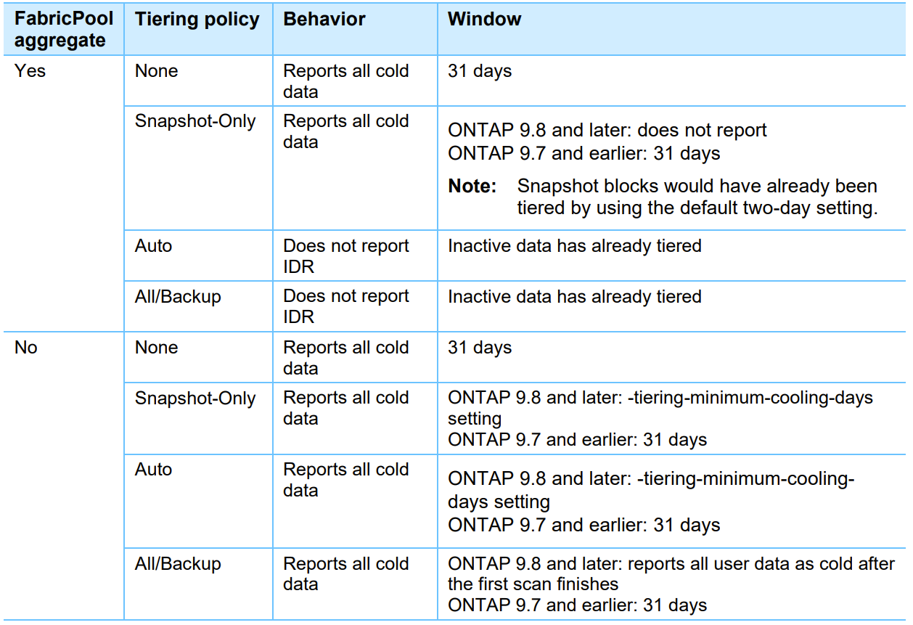
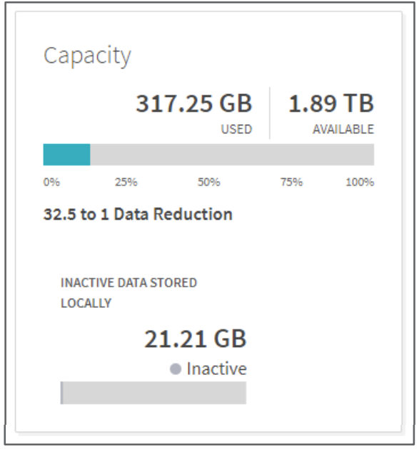
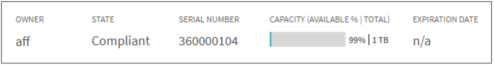
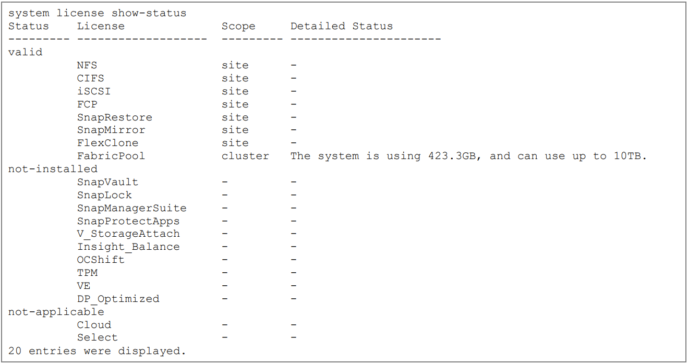
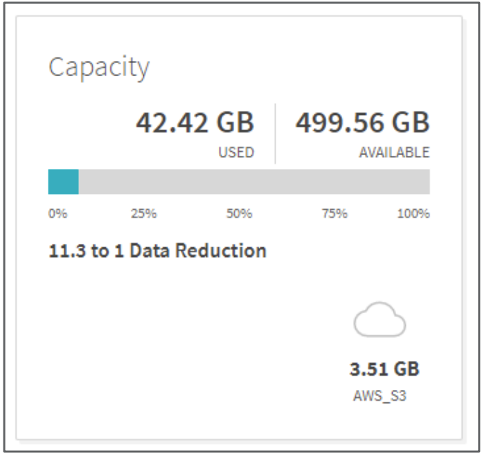
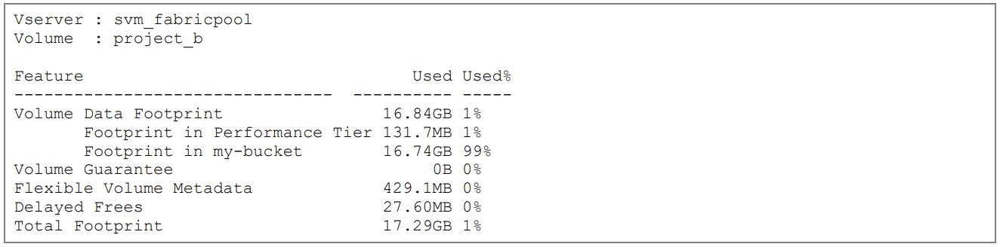
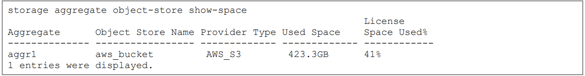

# Sizing and Tiering

FabricPool’s seamless data transfer between local and cloud tiers is maintained through __sizing__ and __tiering__. __Sizing__ refers to the process of determining the storage capacity required for the entire storage infrastructure, whereas __tiering__ refers to the actual dynamic transfer of data between local and cloud tiers. How you size the local and cloud tiers can affect how data will be tiered. 

FabricPool automatically categorizes data blocks as either active “hot” blocks, or inactive “cold” blocks. For the sake of optimizing local storage speeds, inactive cold data is tiered to the cloud tier, while frequently used hot data remains on the local tier. 

It’s important to correctly configure sizing for FabricPool to function securely and quickly. An inadequately sized cloud tier may limit and obstruct the tiering process, since the cloud tier isn’t  able to properly read or write cold data if the sizing ratio is off. First available in ONTAP 9.4, Inactive Data Reporting (IDR) is the default tool used to determine what amounts of cold data can be tiered. You can change tiering configurations and IDR parameters through either ONTAP CLI or the ONTAP system manager. 

## Inactive data reporting
Introduced in ONTAP 9.4, Inactive Data Reporting (IDR) is ONTAP’s built-in tool that decides what amounts of inactive cold data will be tiered from the local tier. By default, IDR uses a 31-day cooling period to determine whether data is hot or cold. This period can be changed in versions after ONTAP 9.8, but versions before ONTAP 9.8 use a fixed 31-day cooling period that can’t be altered. The tiering policies you apply on different volumes will decide the amount of cold data that is tiered. Basically, the cooling period applies globally across aggregates, but the volume tiering policies define how data within specific volumes is managed. 

### IDR behavior table for ONTAP version history  
Figure 1 shows how IDR behaves with its corresponding ONTAP version. You can use this table to see how IDR will report cold data in the ONTAP version you're using. 
   <small>Figure 1</small>

#### Viewing in ONTAP System Manager
To view the IDR status, open the ONTAP System Manager and select local tiers overview. The interface should look similar to figure 2:  
   <small>Figure 2</small>

#### ONTAP CLI 
If you're using ONTAP 9.6 or later and have a Solid State Drive (SSD) local tier, IDR is turned on by default. However, if your client workload demands 100% of the system resources, IDR might automatically turn off to allocate resources elsewhere. If this happens, IDR doesn't switch back on by itself. To ensure IDR stays active and doesn't get turned off for other workloads, you should manually enable '-is-inactive-data-reporting-enabled' to true.

To display IDR by using the ONTAP CLI, run the following command: 

`storage aggregate modify -aggregate <name> -is-inactive-data-reporting-enabled true`

To enable IDR on a non-FabricPool local tier, run the following command:

`storage aggregate show-space -fields performance-tier-inactive-user-data, performance-tier-inactive-user-data-percent` 

To display IDR on a single volume by using the ONTAP CLI, run the following command:

`Volume show -fields performance-tier-inactive-user-data, performance-tier-inactive-user-datapercent`

Note: The ‘`performance-tier-inactive-user-data-percent`’ field shows what percentage of the volume's total capacity is inactive, not the percentage of the used capacity.

## Data Sizing 

NetApp’s recommended ratio for sizing storage infrastructure is 1 : 10 : local tier : cloud tier. This standard ratio is actually extremely conservative for most environments, but will still significantly optimize your storage infrastructure. You can alter this ratio to meet your storage needs. 
### Sizing the local tier
When sizing the local tier, you should ensure the local tier will be capable of the following tasks:
- Supporting hot data 
- Supporting cold data until the tiering scan moves the data to the cloud tier 
- Supporting cloud tier data that becomes hot and is written back to the local tier 
- Supporting WAFL metadata associated with the attached cloud tier 
Writes from the cloud tier to the local tier will be disabled when the local tier capacity exceeds 90%. In this event, blocks will be read directly from the cloud tier. 

### Sizing the cloud tier
When sizing the cloud tier, you should ensure the cloud tier will be capable of the following tasks:
- Supporting reads of existing cold data 
- Supporting writes of new cold data
- Supporting object deletion and defragmentation 
- Supporting at least 700 Transmission Control Protocol (TCP) connections

## Data Tiering 
### Tiering maximum capacity
As mentioned in the Sizing section, NetApp’s recommended 1:10 local tier: cloud tier ratio is generally more conservative than necessary for most environments. If you decide to reduce this ratio when sizing the cloud tier, you should note that FabricPool continues to tier cold data to a cloud tier until the local tier reaches 98% capacity. For example, an 800TB local tier would reach 98% capacity at 784TB. With 5% of the dataset allocated for metadata, it is possible to tier approximately 15.6PB to the cloud before the local tier reaches 98% of its capacity at 784TB.
### Available license capacity
When the cloud storage nears its limit at 85% of the licensed capacity, a warning will be displayed. If the amount of used capacity data stored on the third-party cloud tier reaches the licensed capacity, the system will temporarily stop moving additional data to the cloud. This pause in tiering will include SnapMirror copies using the 'All' tiering policy. Your data will remain accessible while tiering is paused, and cold data will continue to be stored on the local tier. To resume uninterrupted data tiering, you will have to increase the third party license capacity. 

#### Viewing in ONTAP System Manager
To view the capacity status of the FabricPool license using ONTAP System Manager, complete the following steps:

1. Select CLUSTER. 
2. Select Settings. 
3. Select FabricPool License. 

The capacity will be listed in the Current Capacity column.

The license capacity interface will look similar to figure 3:  
  <small>Figure 3</small>

#### ONTAP CLI 
To view the capacity status of the FabricPool license through the ONTAP CLI, run the following command:

`system license show-status`

This output should look similar to figure 4:  
 <small>Figure 4</small>
### Tiering during data migrations
You may run out of space on a small local tier due to a difference in ingress and egress transfer rates. This can happen if you try to migrate data that exceeds the local tier’s capacity. Data usually comes into the local tier at a rate faster than it can be converted into objects and tiered out to the cloud tier. For instance, if a volume move happens at 2GBps, but tiering operates at 500MBps, it takes about 7 hours to complete the volume move in the local storage, while around 28 hours are needed to move the same data to the cloud. You should ensure that the local tier has enough capacity to store the data before it is tiered. You can see local space utilization by using the ONTAP System Manager or the ONTAP CLI.
### Using local tier space 
#### Viewing in ONTAP System Manager
You can view FabricPool space utilization in the local tiers overview section of the ONTAP System Manager. This section includes information about the maximum capacity for the local tier, the overall used capacity, and the used capacity for the external tier.  
  <small>Figure 5</small>

#### ONTAP CLI 
To view FabricPool space utilization details using the ONTAP CLI, run the following command:

`storage aggregate object-store show-space`

The output should look similar to figure 6:  
 <small>Figure 6</small>

### Using volume space 
In FabricPool, FlexVol volumes in the local tier can't exceed 100TB, regardless of whether the data is stored locally or on the cloud. For instance, if you have a FlexVol with 1TB on the local tier and 99TB on the cloud tier, it will be at the maximum 100TB size limit. However, unlike FlexVol volumes, FlexGroup volumes offer more flexibility with virtually no size or file count constraints, except for the physical limits of hardware or the total volume limits of ONTAP.

As mentioned earlier, it’s important you monitor your local tier’s capacity. If your local tier reaches 90% capacity, cold data will be directly read from the cloud without being written back to the local tier. If your local tier reaches 98% capacity, FabricPool will stop tiering cold data to the cloud tier altogether. To check how your FabricPool volumes are doing, you can see the space utilization by using the ONTAP System Manager or the ONTAP CLI.
### Storing virtualized objects 
If you're using virtualized object stores (also known as bare metal object storage), it's critical that you not store them in volumes that automatically move inactive data to the cloud. Make sure to set the tiering policy on those volumes to 'None.'

Not setting the tiering policy to 'None' may cause the virtualized object store to face issues. This happens because blocks associated with virtual machines may be marked as 'cold' and get moved into themselves, causing delays and reducing performance when reading data.

#### ONTAP CLI 
To view FabricPool volume space utilization details using the ONTAP CLI, run the following command:  
`volume show-footprint`
 

The total local tier (performance tier) and cloud tier (using the bucket name) footprints will be displayed in the output. This output should look similar to figure 7:  
 <small>Figure 7</small>
